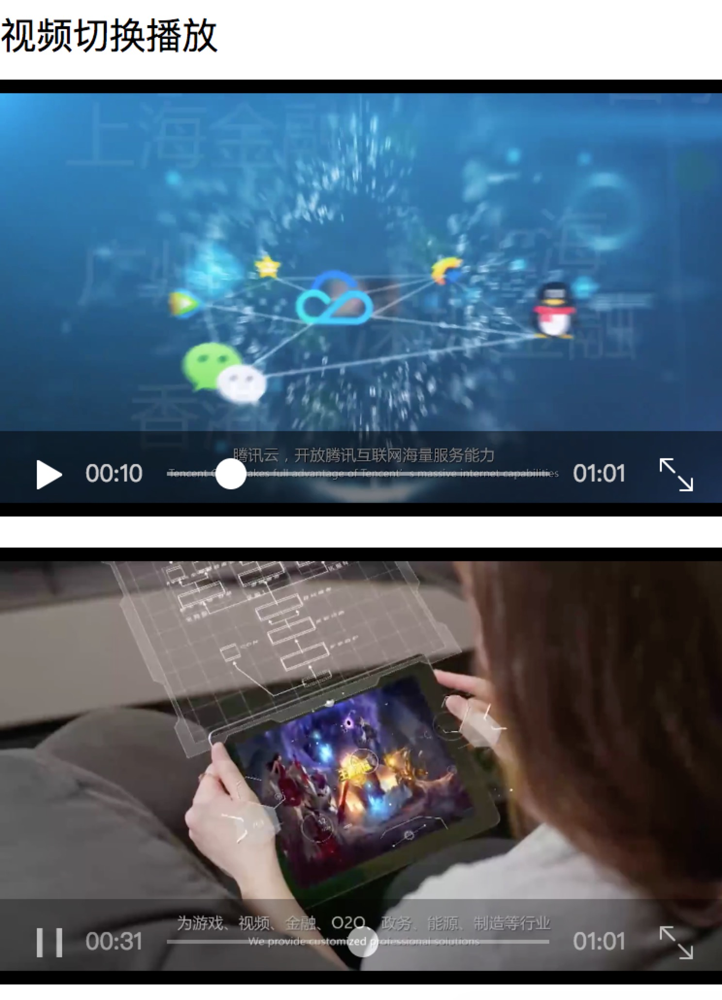

# videoUI

-  videoUI 视频切换播放和全屏播放 微信小程序

## 解决痛点：
- 解决了viode自动下载的bug
    加快页面加载速度，为用户节省流量
- 视频切换播放
    
- 解决视频缓存中卡住的问题
    腾讯给出的方案是：
        custom-cache="{{false}}"
- 视频全屏播放
    解决iPhone X兼容问题
    

## 说明：
* 我们贝壳亲自英语小程序，经过多版本迭代，优化了视频体验流程，这个项目是从实际项目抽离出的精华
* 喜欢请start，您的支持就是我的动力…

* 项目地址: [https://github.com/mrzhang90/videoUI](https://github.com/mrzhang90/videoUI)
